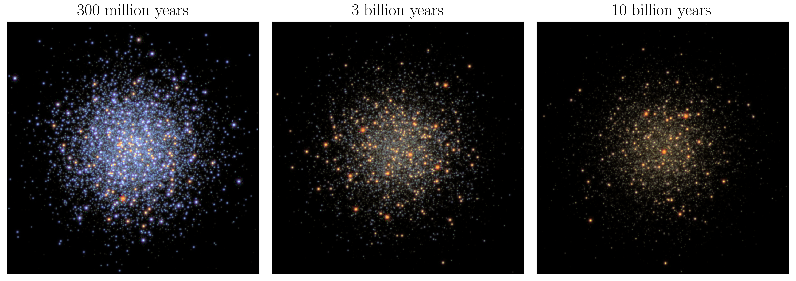
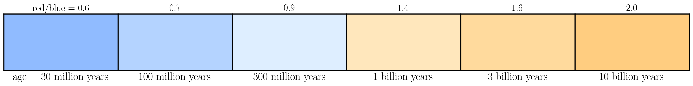

# 👾 Love thy Pixels 👾
---

## Overview
This repo contains material from part of a week-long [program at Ohio State](https://u.osu.edu/aspire/) for middle schoolers. This particular activity uses `ltpix` (Love thy Pixels), a pedagogical software package designed to give the students hands-on experience in coding and image processing. And because they make the most beautiful images, the subject matter is galaxies!

---

## 👩‍💻 Code Example

```python 
from ltpix import AstroImage

# Enter the galaxy number (1, 2, 3, or 4) into 
# the parentheses like this AstroImage(<galaxy number>)
galaxy = AstroImage(2) 

galaxy.display_rgb_image()
```


## 🎨 Extracting information from star colors!




Star clusters are groups of stars that are born at approximately the same moment in time. Interestingly, it turns out that the average color of such a group of stars is directly related to how old they are! Of course, understanding the details of this relationship is an entire field of research. Nevertheless, we can learn a lot about star clusters by measuring their colors. The above images are simulations created using [ArtPop](https://github.com/ArtificialStellarPopulations/ArtPop), which show how the color of a population of stars evolves with time. 

---
## 🎢 Activity Outline

[(1) Intro to Jupyter Notebooks and Python](https://nbviewer.jupyter.org/github/johnnygreco/love-thy-pixels/blob/master/notebooks/intro-to-python.ipynb?flush_cache=true)

[(2) Intro to Images](https://nbviewer.jupyter.org/github/johnnygreco/love-thy-pixels/blob/master/notebooks/intro-to-images.ipynb?flush_cache=true)

[(3) Galaxy Images!](https://nbviewer.jupyter.org/github/johnnygreco/love-thy-pixels/blob/master/notebooks/galaxy-images.ipynb?flush_cache=true)

[(4) Galaxy Colors and Ages!](https://nbviewer.jupyter.org/github/johnnygreco/love-thy-pixels/blob/master/notebooks/galaxy-colors.ipynb?flush_cache=true)

[(5) Exploring the Sky](https://nbviewer.jupyter.org/github/johnnygreco/love-thy-pixels/blob/master/notebooks/legacy-viewer.ipynb?flush_cache=true)
